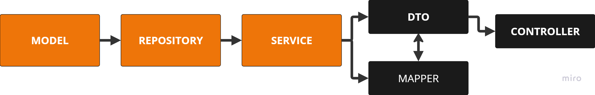

# PROJETO QUIZ - MJV School #

Projeto desenvolvido durante o curso de Java oferecido pela MJV School ministrado pelo professor Samuel, com a finalidade de criar um sistema de quiz 
conectado a um banco de dados. 

-----------------------------------------
# Ferramentas utilizadas no projeto #

                            

- **Linguagem**: Java 21
- **Framework**: Spring Boot
- **Banco de Dados**: PostgreSQL

------------------------------------------

# Diagrama - Lógica # 

O projeto ainda está em andamento, com o objetivo de adotar o modelo de arquitetura de software MVC (Model-View-Controller). Esse modelo sugere uma abordagem estruturada para dividir as responsabilidades de forma mais clara e eficiente.

> [!NOTE]
> Até o momento foram criadas as etapas em laranja no diagrama.

------------------------------------------

# Testes #

Inicialmente foram desenvolvidos testes para avaliar a funcionalidade do código, abrangendo as operações CRUD (Create, Read, Update, Delete), que são essenciais no desenvolvimento de qualquer aplicação. Essas operações foram aplicadas em bases de dados relacionais para assegurar que os dados fossem armazenados e manipulados corretamente pelos usuários do sistema:

- UserTest
- QuestionTest
- AlternativeTest

------------------------------------------

# Próximos passos #

- [ ] Criação das demais estruturas do diagrama.

------------------------------------------

# Atalhos interessantes #

- _ctrl + shift + o_ - Remove os imports que não estão sendo utilizados;
- _shift + F6_ - Renomeia o texto alterado em todo o código.
